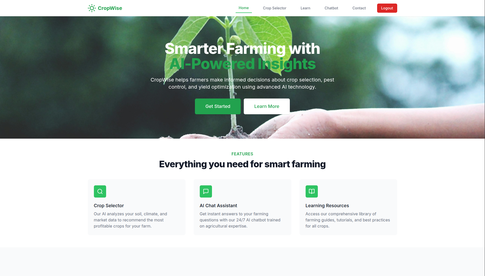
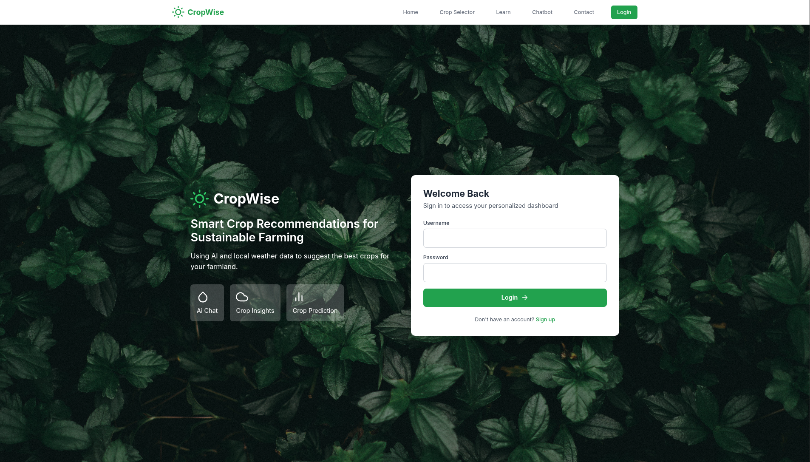
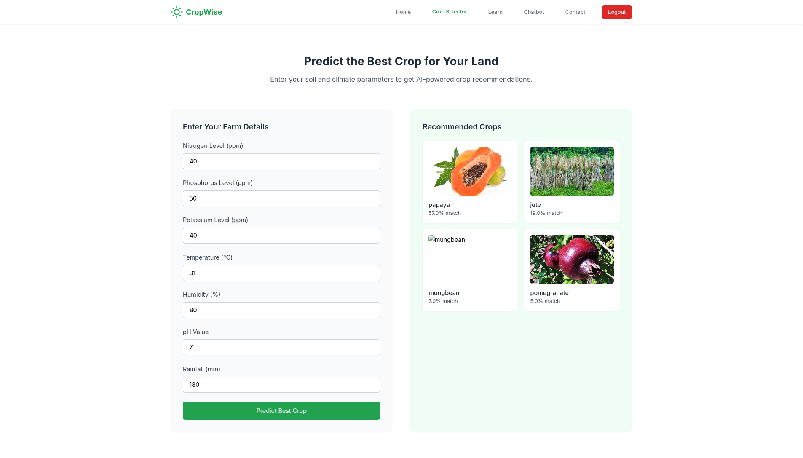
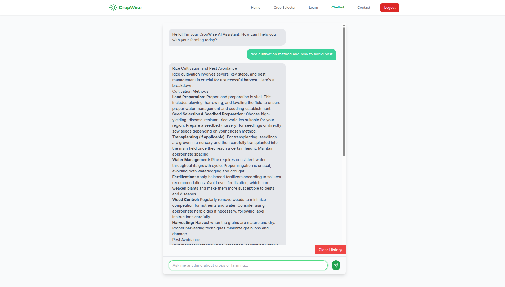
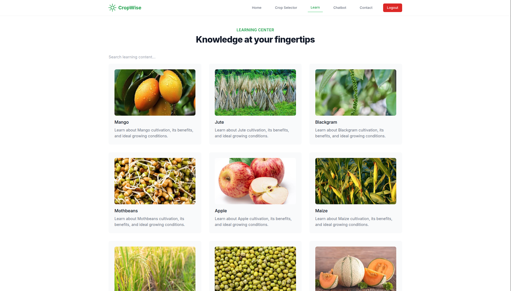
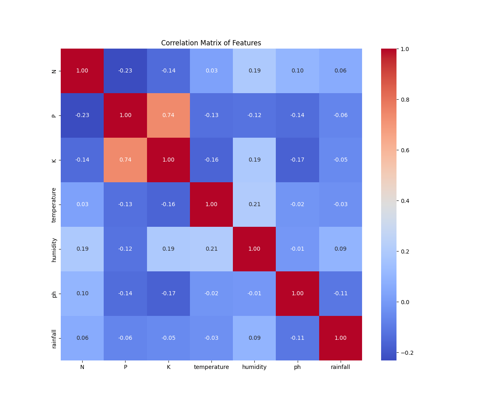
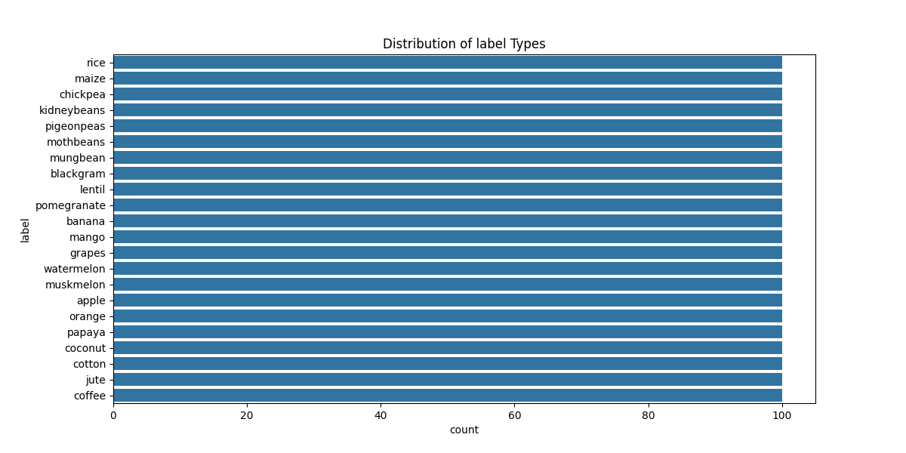
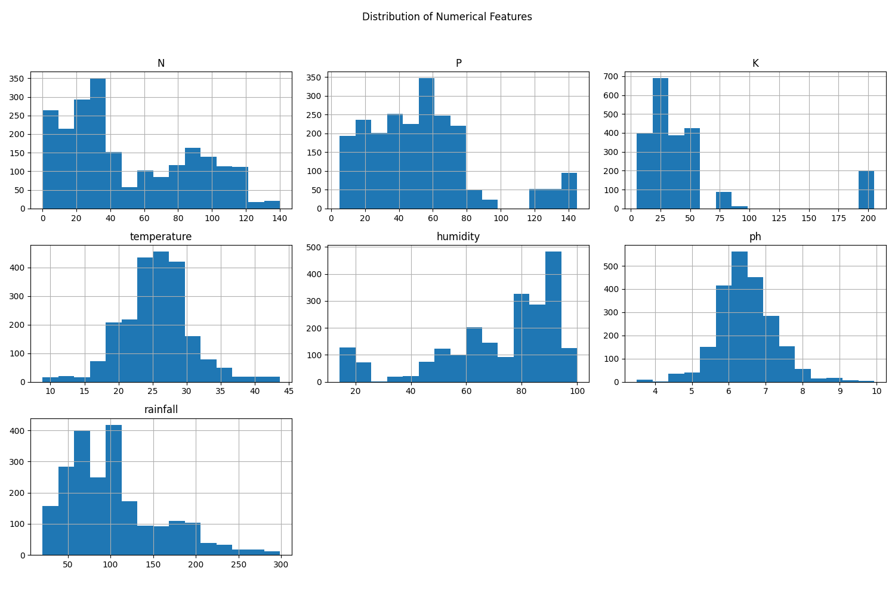
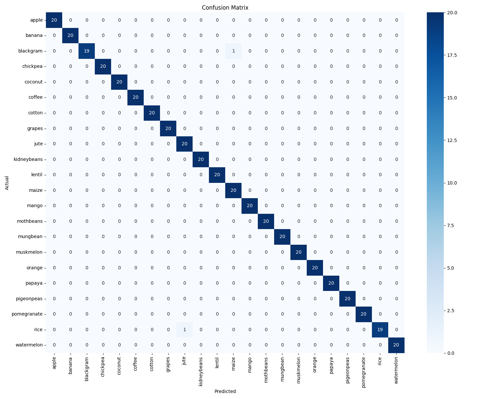
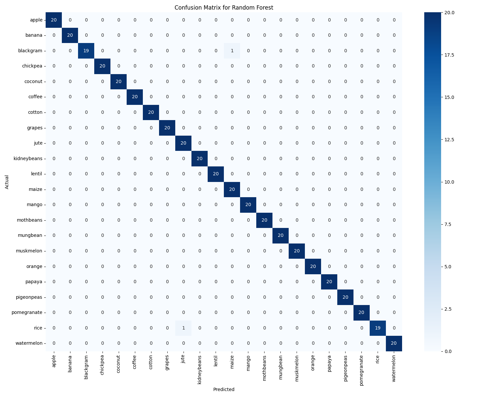

# CropWise

## Overview
This is a Django-based web application designed to assist farmers with crop management, prediction, and learning resources. It aims to provide tools for better decision-making in agriculture.

## Features
*   **Crop Recommendation:** Utilizes machine learning to recommend suitable crops based on various parameters.
*   **Farmer Management:** Functionality to manage farmer profiles and related data.
*   **Learning Content:** Provides educational resources and information for farmers.
*   **Interactive Chatbot:** An integrated chatbot for assistance and queries.
*   **User Authentication:** Secure user registration and login system.

## Technologies Used
*   Python
*   Django
*   Machine Learning (for crop prediction)
*   HTML, CSS (for frontend)

## Setup Instructions

### 1. Clone the Repository
```bash
git clone <repository_url>
cd django # or your project root directory
```

### 2. Create and Activate a Virtual Environment
It's recommended to use a virtual environment to manage project dependencies.
```bash
python3 -m venv venv
source venv/bin/activate
```

### 3. Install Dependencies
Install the required Python packages using the `requirements.txt` file.
```bash
pip install -r requirements.txt
```

### 4. Database Migrations
Apply the database migrations to set up the database schema.
```bash
python manage.py migrate
```

### 5. Create a Superuser (Optional)
To access the Django admin panel, create a superuser.
```bash
python manage.py createsuperuser
```
Follow the prompts to set up your username, email, and password.

### 6. Run the Development Server
Start the Django development server.
```bash
python manage.py runserver
```
The application will be accessible at `http://127.0.0.1:8000/`.

## Project Structure
*   `farmer_project/`: Main Django project configuration.
*   `crop/`: Django app for crop-related functionalities, including prediction.
*   `farmer/`: Django app for farmer management.
*   `ML/`: Contains machine learning models and data for crop prediction.
*   `media/`: Directory for user-uploaded media files (e.g., learning images).
*   `static/`: Static assets like CSS and images.
*   `templates/`: HTML templates for the web application.
*   `venv/`: Python virtual environment.
*   `requirements.txt`: Lists all project dependencies.

## Usage
*   Navigate to `http://127.0.0.1:8000/` in your web browser.
*   Register a new user or log in with existing credentials.
*   Explore crop recommendations, farmer management features, and learning content.
*   Interact with the chatbot for assistance.

## Screenshots

### Index Page


### Login Page


### Prediction Page


### Chatbot Interface


### Information Page


## Machine Learning Plots

### Correlation Heatmap


### Crop Distribution


### Numerical Feature Histograms


### Confusion Matrix


### Random Forest Confusion Matrix

